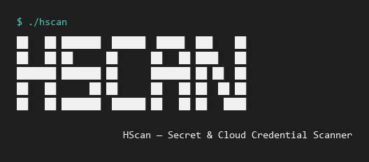
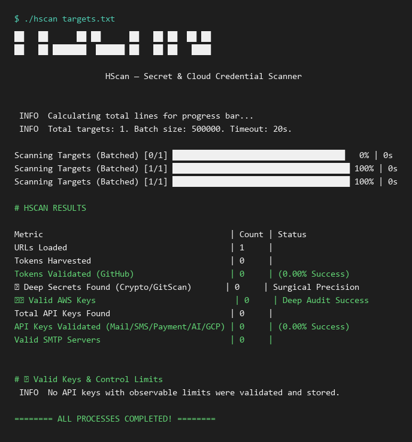
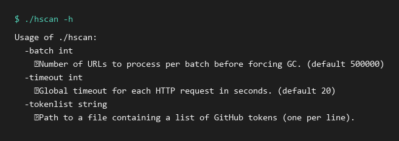

# HScan

A fast, concurrent Go CLI for scanning URLs and files for exposed secrets, cloud credentials, and API keys.

> **For authorized security research only.** Only scan targets you own or have explicit written permission to test.



---

## Features

- **Multi-source input** — accepts a text file containing URLs or local file paths, one per line.
- **Concurrent scanning** — batched workers with configurable concurrency and timeouts.
- **AWS deep audit** — validates AWS access keys via STS, checks SES quotas, SNS limits, Fargate limits, and S3 access.
- **API key validation** — SendGrid, Stripe, OpenAI, Anthropic, GCP, Mailgun, Twilio, Nexmo, Telnyx, MessageBird.
- **GitHub token harvesting** — scans responses for GitHub tokens and can run a deep scan against repositories.
- **SMTP credential testing** — finds and tests mail server credentials.
- **Telegram alerts** — optional bot notifications for validated finds.
- **Result files** — saves discovered secrets to categorized text files.

---

## Requirements

- Go 1.21+
- Internet access (for validation checks)
- A target list file (`urls.txt` or `files.txt`)

---

## Installation

```bash
git clone https://github.com/H1xxxx/scan.git
cd scan
go mod tidy
go build -o hscan main.go
```

---

## Configuration

Copy the example config and fill in your values:

```bash
cp config.example.json config.json
```

Edit `config.json` to enable/disable modules and add your Telegram details:

```json
{
  "telegram": {
    "bot_token": "YOUR_BOT_TOKEN",
    "chat_id": "YOUR_CHAT_ID"
  },
  "scanning_features": {
    "aws_main_scan": true,
    "github_token_deep_scan": true,
    "smtp_credentials_scan": true
  },
  "aws_checks": {
    "ses_quota_check": true,
    "sns_limit_check": true,
    "fargate_limit_check": true,
    "federation_console_url": true
  },
  "api_validation": {
    "openai": true,
    "anthropic": true,
    "stripe": true,
    "gcp_api_key": true,
    "sendgrid": true,
    "mailgun": true,
    "twilio": true,
    "nexmo": true,
    "telnyx": true,
    "messagebird": true,
    "github": true
  },
  "features": {
    "brevo": true,
    "xsmtp": true,
    "tencent": true,
    "mailgun": true,
    "new_mailgun": true,
    "mandrill": true,
    "mailersend": true,
    "github": true,
    "twilio": true,
    "nexmo": true,
    "telnyx": true,
    "smtp": true
  },
  "smtp_test_email": ""
}
```

---

## Usage

### Interactive mode

```bash
./hscan
```

You will be prompted for the target list path.

### CLI mode

```bash
./hscan targets.txt
```

### GitHub token deep scan

```bash
./hscan -tokenlist tokens.txt
```

### Tuning performance

```bash
./hscan -timeout 30 -batch 100000 targets.txt
```

---

## Target list format

Create a plain text file with one URL or local file path per line:

```text
https://example.com/config.js
https://example.com/.env
file:///C:/Users/H1/Desktop/target.zip
```

---

## Example output



The scanner prints a live progress bar and ends with a summary table showing counts for URLs loaded, tokens harvested, AWS keys validated, API keys validated, and valid SMTP servers.

---

## CLI help



---

## Project structure

```
scan/
├── main.go              # Main scanner implementation
├── config.json          # Working configuration
├── config.example.json  # Example configuration
├── go.mod               # Go module file
├── go.sum               # Go dependency checksums
├── README.md
└── assets/
    ├── screenshot_banner.png
    ├── screenshot_summary.png
    └── screenshot_help.png
```

---

## Legal & ethics

- This tool is intended for bug bounty hunters, penetration testers, and security researchers.
- **Do not scan targets you do not own or have explicit permission to test.**
- Misuse of this tool may violate computer fraud laws and the terms of service of third-party APIs.
- The author is not responsible for misuse.

---

## License

This project is based on original work by Raven. See the source code for license details.
